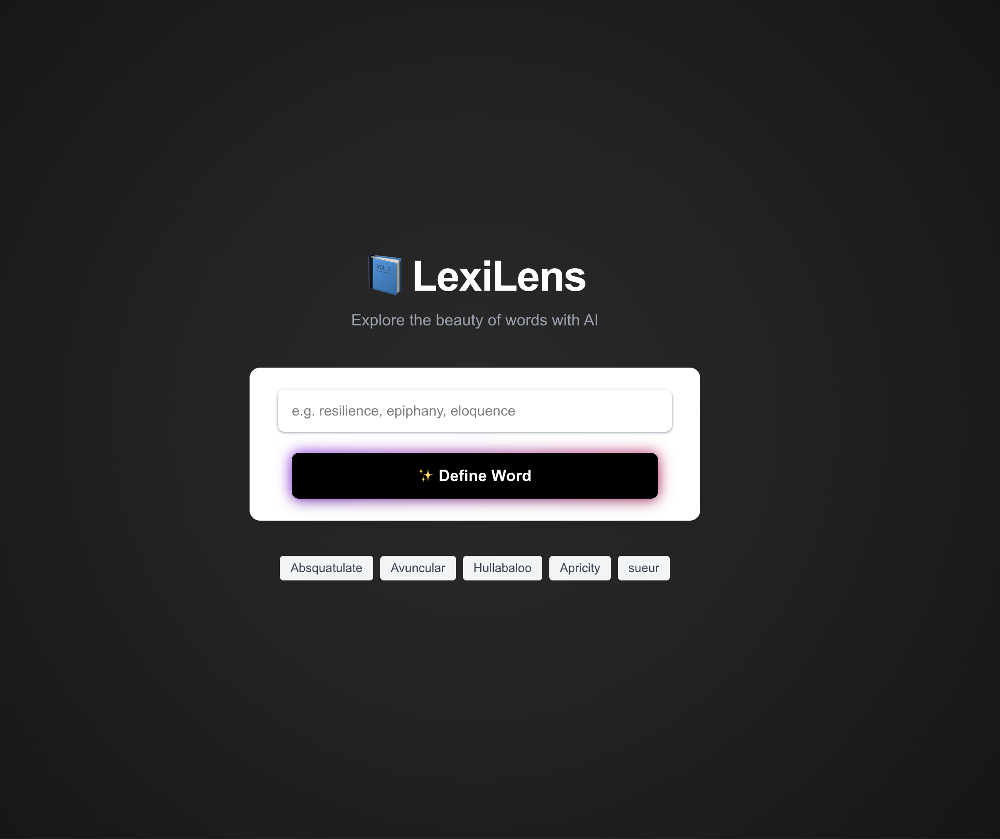

<h1>📘 LexiLens</h1>

  LexiLens is an elegant, AI-powered dictionary app built with <strong>Next.js</strong>, <strong>Tailwind CSS</strong>, and <strong>OpenAI</strong>.
  It lets you explore word definitions, synonyms, antonyms, examples, and even fun facts — all with a stunning UI and instant results.

<h2>✨ Features</h2>
<ul>
  <li>🔍 Define any English word with OpenAI's powerful language model</li>
  <li>🧠 Get synonyms, antonyms, and usage examples</li>
  <li>💡 Discover interesting facts about each word</li>
  <li>⚡ Sleek UI with animations (Framer Motion + Tailwind CSS)</li>
  <li>🕘 History of recent searches (stored in localStorage)</li>
  <li>💬 Token usage + cost display for transparency</li>
</ul>

<h2>🚀 Live Demo</h2>

  Check out the deployed app: 
  👉 <a href="https://lexilens.vercel.app" target="_blank">https://lexilens.vercel.app</a>

<h2>🛠 Tech Stack</h2>
<ul>
  <li><a href="https://nextjs.org/" target="_blank">Next.js 15</a></li>
  <li><a href="https://tailwindcss.com/" target="_blank">Tailwind CSS</a></li>
  <li><a href="https://www.framer.com/motion/" target="_blank">Framer Motion</a></li>
  <li><a href="https://platform.openai.com/" target="_blank">OpenAI API</a></li>
  <li><a href="https://vercel.com/" target="_blank">Vercel</a> for deployment</li>
</ul>

<h2>🔐 Environment Variables</h2>

  To run this app locally, create a <code>.env.local</code> file in the root directory with:

<pre><code>OPENAI_API_KEY=your_openai_api_key</code></pre>

<h2>🧑‍💻 Getting Started</h2>
<ol>
  <li>
    <strong>Clone the repository</strong> 
    <code>git clone https://github.com/arath089/Lexilens.git</code> 
    <code>cd Lexilens</code>
  </li>
  <li>
    <strong>Install dependencies</strong> 
    <code>yarn install</code>
  </li>
  <li>
    <strong>Run the development server</strong> 
    <code>yarn dev</code> 
    Then open <a href="http://localhost:3000" target="_blank">http://localhost:3000</a> in your browser.
  </li>
</ol>

<h2>🧾 Token Cost Calculation</h2>

  LexiLens displays the number of tokens used and the approximate cost of each definition request.
  This helps you keep track of OpenAI API usage and spending.

<h2>📁 Project Structure</h2>
<pre><code>lexilens/
├── public/
├── src/
│   └── pages/
│       ├── index.js         # Main UI
│       └── api/define.js    # OpenAI API integration
├── .env.local               # Your OpenAI API key
├── tailwind.config.js       # Tailwind setup
├── README.md
└── ...
</code></pre>

<h2>🛡 License</h2>

  MIT © <a href="https://github.com/arath089" target="_blank">@arath089</a>

